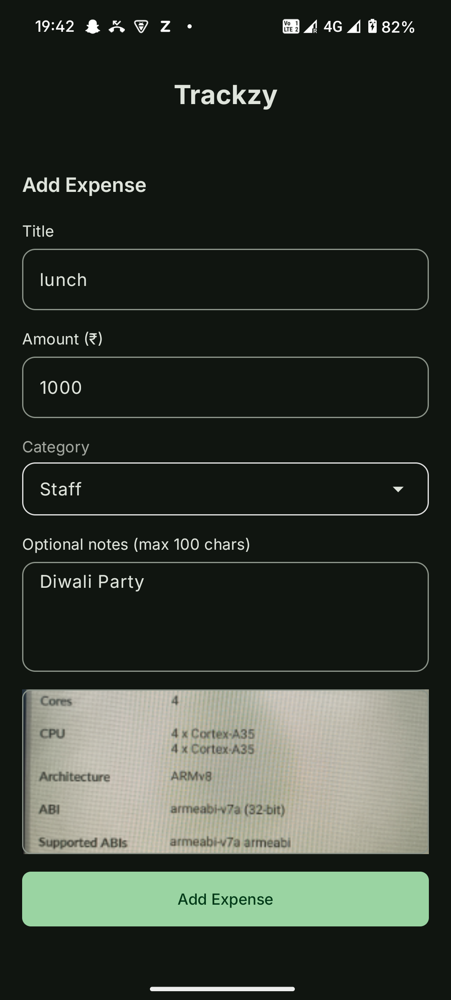
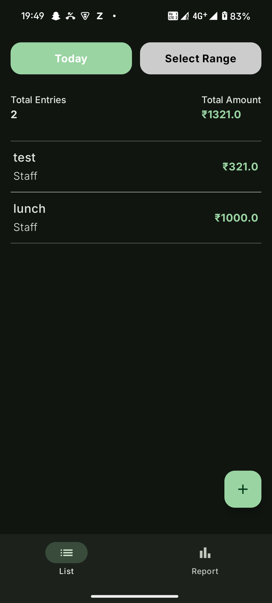
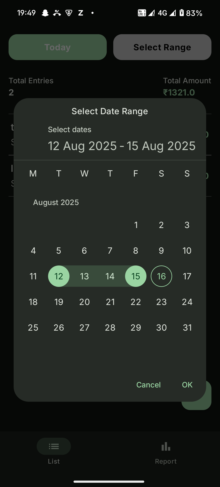
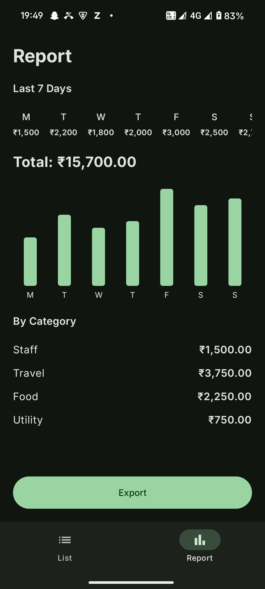

# ExpenseTracker

ExpenseTracker is a modern Android application designed to help users efficiently track and manage their daily expenses. Built using the latest Android technologies, it leverages Jetpack Compose for a responsive and intuitive UI, Room for robust local data storage, and Hilt for seamless dependency injection. The app follows the MVVM (Model-View-ViewModel) architecture, ensuring a clean separation of concerns and maintainable code.

## Features

### Expense Entry Screen
- Add expense with:
    - Title
    - Amount (₹)
    - Category (Staff, Travel, Food, Utility)
    - Optional notes (max 100 chars)
    - Optional receipt image
- Shows real-time **Total Spent Today**
- Validates input fields:
    - Amount must be a positive number
    - Title and category are required
    - Notes must not exceed 100 characters
### Expense List Screen
- View expenses by date (default: today)
- Group by category or time
- Displays **Total Entries** and **Total Amount**

### Expense Report Screen
- Weekly report (mocked for last 7 days)
- Shows **daily totals**, **category-wise totals**
- Displays **bar chart**
- Option to **export data to CSV**

### Additional Features
- **Dynamic Theme** based on wallpaper color
- Local persistence with **Room**
- Clean MVVM architecture with **StateFlow**
- Reusable **UI components**
- **Dark Mode** support

## Android Tech Stack & SDK

This project uses the following Android technologies and SDK versions:

- **Minimum SDK:** 24 (Android 7.0 Nougat)
- **Target SDK:** 36 (Android 16)
- **Compile SDK:** 36

**Tech Stack:**
- **Jetpack Compose:** Modern declarative UI toolkit for building native Android UIs.
- **Room:** SQLite object mapping library for local data persistence.
- **Hilt:** Dependency injection framework for Android.
- **MVVM Architecture:** Separation of concerns using Model, View, and ViewModel.
- **StateFlow:** For reactive state management in ViewModels.
- **Coroutines:** For asynchronous programming and background tasks.
- **Material Design 3:** For UI components and theming.
- **Navigation Compose:** For in-app navigation.
- **Kotlin Serialization:** For JSON serialization/deserialization.
- **Accompanist:** For permissions handling and animated navigation.
- **Coil:** Image loading library for Compose.
- **Compose BOM:** For managing Compose library versions.
- **Kotlin:** Primary programming language.

## Project Structure

- `data/` – Contains Room entities, DAOs, repositories, and data mappers.
- `domain/` – Houses domain models and repository interfaces.
- `presentation/` – UI screens, navigation logic, and ViewModels.
- `ui/theme/` – Theming resources such as colors and typography.
- `core/di/` – Hilt dependency injection modules.
- `MainActivity.kt` – The main entry point and navigation host for the app.

## Permissions

- The app requests `WRITE_EXTERNAL_STORAGE` permission, which is used to exporting csv.

## Screenshots

Below are some screenshots of the ExpenseTracker app:

> **Tip:** For better project organization, store your screenshot images in an `images/` folder at the project root.  
> Update the image links below if you move the files.

| Add Expense Screen | Expense List Screen |
|:------------------:|:------------------:|
|  |  |

| Range Selection Screen | Weekly Report Screen |
|:----------------------:|:-------------------:|
|  |  |
